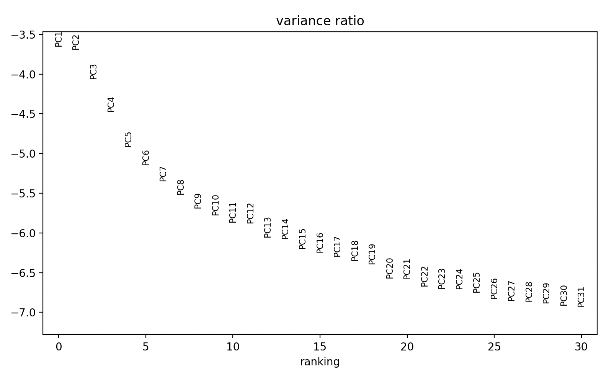
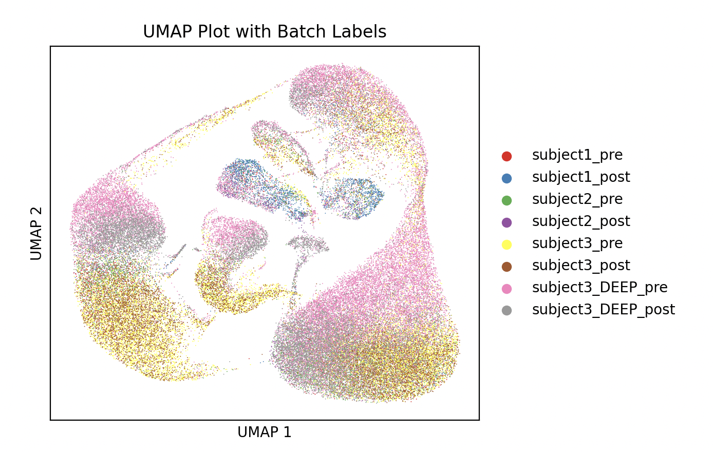

# 🧬 Project Introduction 
This project was inspired by Figure 1 Lab, which helps users enhance their computational biology skills by recreating Figure 1 from modern biology papers. Instead of following the standard F1L format, I decided to put my own spin on it by replicating the findings of the paper titled [Single-cell sequencing deconvolutes cellular responses to exercise in human skeletal muscle](https://www.nature.com/articles/s42003-022-04088-z). Importantly, when I say "replicating the findings", I'm reffering to the outcomes reported by the investigators. The code in this project repository is my own, and my goal is for my findings to converge with those of the original investigators, despite often taking a different path to that end destination.

This README is divided into four parts, as described below:
- In the first first part, titled ```Read and Understand Paper```, I'll dissect the paper and explain the key points.
- Then, in the second part, ```Data Accessibility```, I'll walk you through the processes of accessing the data from this paper, loading it into your project directory, and combining all sample data into a single AnnData object for downstream analysis.
- After that, the section titled ```Data Processing``` will cover the ins and outs of performing quality control, filtering, normalization, and dimensionality reduction.
- Finally, the last section titled ```Data Analysis``` will be dedicated to reproducing analyses from the paper and/or other analyses using the data from this paper.

# 🧬 Read and Understand Paper
Before loading any data or beginning exploratory data analysis, I read the paper twice. The first reading provides a broad overview of the project, while the second focuses on dissecting the researchers' methods and findings. In this section of my project's README, you'll find a detailed breakdown of each section of the paper. This breakdown will help you understand what the researchers did, why it’s important, and what they discovered.

### Introduction
Research into the molecular mechanisms underlying exercise adaptations have focused primarily on whole muscle and muscle fibers, leaving a gap in our understanding of how specific cell populations within the muscle respond to exercise. However, recent years have seen the development of new single-cell sequencing technologies that can help fill this gap.

Single-cell RNA sequencing (scRNA-seq) is a powerful technique that allows researchers to study the gene expression profiles of individual cells. Unlike bulk RNA sequencing, which measures gene expression in a mixed population of cells and provides a readout for the entire sample, scRNA-seq offers a high-resolution view of cellular diversity and function.

Existing studies indicate that various cell populations within muscle (ex, immune cells, fibroblasts, endothelial cells) are vital for beneficial adaptations. Given the importance of these different cell populations, a detailed understanding of how each cell type in skeletal muscle responds to exercise could provide valuable insights into tissue remodeling processes. Thus, the purpose of this study is to use scRNA-sequencing to analyze single cells from skeletal muscle biopsies taken before and after strenuous exercise. 

### Methods
Three healthy, moderately active, individuals (one female, two male) were tasked with performing 3x30 second all out sprints on a cycle ergometer with two minutes of recovery between sets. The average peak power output for the group was 8.87 watts/kg, plus or minus 2 watts/kg, which would equate to a 160lb (73kg) male peaking out at ~500-780 watts, for example.

In addition to performing the aforementioned exercise protocol, each subject underwent two muscle biopsies on the vastus lateralis (i.e. outer quadriceps) muscle. The first biopsy was taken immediately before exercise, and the second biopsy was taken three hours post exercise. The six muscle biopsies (two for each subject) were then processed (cleaned of adipose and connective tissue, etc) and stored on ice prior to high-resolution single cell RNA sequencing. 

### Results
#### Cell Type Annotation and Reproducibility 
After combining and analyzing the all three subjects RNA sequencing data, and then performing Leiden-based clustering, the investigators identified six major cell types: myogenic cells (muscle cells), endothelial cells (cells lining blood vessels), pericytes (support cells for blood vessels), mesenchymal cells (stem cells that can differentiate into various cell types), lymphoid cells (immune cells), and monocytes (another type of immune cell). To confirm the identity of these cells types, the investigators compared their gene expression profiles with the CellMatch database (among other methods). This approach ensured that the cell type identifications were accurate and reproducible across different subjects and samples. 

Additionally, to ensure consistency of cell types and their proportions across different samples, the investigators used a method called inter-sample anchoring scores, which measure how well the samples correlate with each other. The scores ranged from 0.6 to 0.7, indicating a strong agreement both between different subjects and within the same subject. This means that all subjects had similar types and proportions of cells in their samples. Additionally, the investigators. 

#### Effects of Exercise On Cellular Composition
Three hours after exercise, the number of circulating cells increased significantly. Specifically, lymphocytes (a type of immune cell) rose from 4% to 9% (p = 0.05) and monocytes (another type of immune cell) went from 2% to 4% (p < 0.05). At the same time, the proportion of resident cells decreased: endothelial cells (which line blood vessels) dropped from 44% to 37%, and pericytes (support cells for blood vessels) fell from 6% to 5%. The proportion of myogenic cells (muscle cells) stayed the same at 18%.

#### Transcriptional Response to Exercise 
The investigators analyzed how gene expression in different cell types responded to exercise by comparing pre- and post-exercise data. They found that 874 genes (535 unique) were differentially expressed across all cell types (fdr < 0.05). Here are the key findings for each cell type:
- Mesenchymal Cells: These cells had the strongest response to exercise, with 304 genes showing changes in expression. The genes were mainly related to tissue regeneration and remodeling, cytoskeletal reorganization ,and cell-cycle activation.
- Endothelial Cells: These cells had the second highest response, with 281 differentially expressed genes. Key functions included cell activation and stress responses, such as "cell cycle G2 M-phase transition", "energy reserve metabolic response", and "tissue regeneration".
- Myogenic Cells: These cells showed changes in 111 genes post-exercise, including important muscle differentiation genes like MYOD1 and MYF6. In the undifferentiated PAX7+ cluster, the changes were mainly related to cellular stress responses, such as "negative regulation of cell death" and "regulation of growth".
- Monocytes: There were 120 differentially expressed genes in monocytes after exercise. Their response included general processes like "amide biosynthetic process", "protein targeting", and "peptide metabolic process". Significant genes like NFKBIA, CTSS, HLA-C, and SLC25A6 indicated an inflammatory response and cellular stress reactions to exercise.
- Pericytes: There were 49 differentially expressed genes in pericytes. Their response suggested cellular activation, stress response, and regeneration, with enrichment in 38 ontologies such as "response to wounding", "actin-mediated cell contraction", and "cell cycle G2 M-phase transition".
- Lymphocytes: These cells showed changes in only 9 genes post-exercise. The gene ontologies were generic, indicating a minimal response specific to exercise.

#### Trajectory Analysis of Myogenic Cells
One major advantage of single-cell RNA sequencing (scRNA-seq) is its ability to use the complete set of RNA transcripts in each cell to classify cell populations. This method can reduce the complexity to just one or two dimensions, allowing us to visualize and identify gradual changes in gene expression from one cell to another. This approach is known as trajectory analysis. Trajectory analysis has proven to be a powerful tool for uncovering step-by-step changes in gene expression during developmental processes and stem cell differentiation.

In this study, trajectory analysis was used investigate whether there is a continuous transition from undifferentiated myogenic cells to more mature myogenic cells. The investigators focused on three distinct cell clusters: undifferentiated PAX7+ satellite/myoblast cells, TNNI2+ fast-twitch myogenic cells, and TNNI1+ slow-twitch myogenic cells. They calculated two trajectories starting from the undifferentiated PAX7+ cluster using principal curve pseudotime analysis. This analysis showed that the transition of these undifferentiated cells towards more differentiated states was proportional to the expression levels of specific marker genes along these trajectories.

The investigators also examined the impact of exercise on the transition from PAX7+ undifferentiated satellite/myoblast cells to both fast- and slow-twitch myogenic cells, as well as the overall transcriptional changes in these subpopulations. Three hours after a single exercise session, there was a small but statistically significant shift in pseudotime toward a higher degree of differentiation in both the slow-twitch (Δslow-twitch = 5.4%, p < 0.001) and fast-twitch (Δfast-twitch = 9.0%, p < 0.001) cell populations.

Additionally, they observed a common transcriptional response to exercise in all three myogenic subpopulations, involving 24 genes primarily related to mitochondrial and ribosomal functions. However, the number of genes affected by exercise varied between the subpopulations: 255 genes were regulated in the undifferentiated PAX7+ cells, 138 genes in the slow-twitch cells, and 51 genes in the fast-twitch cells.

### Discussion
In this study, single-cell RNA sequencing (scRNA-seq) was used to analyze the cellular composition of adult human skeletal muscle. The investigators found that the cellular composition is consistent within and between individuals. Additionally, they observed changes in cell composition and transcriptional activity after exercise, highlighting the need for deeper and more detailed analyses of specific tissues in relation to physiology, along with methodological validation.

The scRNA-seq analysis showed that skeletal muscle contains various cell types, with endothelial cells making up the largest proportion (44%), followed by mesenchymal cells (26%), myogenic cells (18%), and pericytes (6%), lymphocytes (4%) and monocytes (2%). Additionally, the study identified three myogenic cell groups at different maturation stages, with exercise promoting the maturation of undifferentiated myogenic cells towards slow- or fast-twitch fibers, which may contribute to specific phenotypic adaptations from exercise.

While the study primarily focused on the immediate effects of a single exercise session on the cellular transcriptional landscape in skeletal muscle, it's important to note the limitations. The small number of subjects restricts the generalizability of the findings, as only features and effects consistent across all subjects were identified, potentially overlooking variations due to sex and age. Despite this limitation, the study demonstrated the reliability of scRNA-seq analysis in quantifying and delineating cell populations across different subjects.

# 🧬 Data Accesibility
The raw and processed sequencing data from this study is publicly available through Gene-Expression omnibus (GEO) accession number GSE214544, which you can find [here](https://www.ncbi.nlm.nih.gov/geo/query/acc.cgi?acc=GSE214544).

After navigating to GEO, you'll find that there are 8 samples available for this study. These include a skeletal muscle sample taken before and after exercise for all three subjects, then two additional samples for subject three labeled "deep seq". 

To generate the data used in this study, sequencing was performed with an Illumina NextSeq 2000. Then, a software package called Cell Ranger from 10x Genomics was used to convert the raw sequenced data generated by the Illumina sequencer into FASTQ files, a standard format for storing DNA and RNA sequences. Finally, the FASTQ files were aligned to a reference human genome (GRCh38), which tells us where each piece of RNA comes from in the human genome. 

For each of the 8 samples mentioned above, there are three associated files:
- Matrix files (```matrix.mtx.gz```) : These contain the expression data matrix in Market Exchange Format, with rows for genes, columns for cells, and values representing UMI counts.
- Barcode files ((```barcodes.tsv.gz(```): Contains cell barcodes, representing individual cells.
- Feature files (```features.tsv.gz```): Contains gene or transcript information, including ID, name, and type.

There are multiple ways to access this data, but I chose the following method (demonstrated for [Skeletal muscle Sample 1 pre exercise](https://www.ncbi.nlm.nih.gov/geo/query/acc.cgi?acc=GSM6611295)):
```
wget -O GSM6611295_P15306_5001_barcodes.tsv.gz 'https://www.ncbi.nlm.nih.gov/geo/download/acc=GSM6611295&format=file&file=GSM6611295%5FP15306%5F5001%5Fbarcodes%2Etsv%2Egz'
wget -O GSM6611295_P15306_5001_features.tsv.gz 'https://www.ncbi.nlm.nih.gov/geo/download/?acc=GSM6611295&format=file&file=GSM6611295%5FP15306%5F5001%5Ffeatures%2Etsv%2Egz'
wget -O GSM6611295_P15306_5001_matrix.mtx.gz 'https://www.ncbi.nlm.nih.gov/geo/download/?acc=GSM6611295&format=file&file=GSM6611295%5FP15306%5F5001%5Fmatrix%2Emtx%2Egz'
gunzip GSM6611295_P15306_5001_barcodes.tsv.gz 
gunzip GSM6611295_P15306_5001_features.tsv.gz
gunzip GSM6611295_P15306_5001_matrix.mtx.gz
```
*Note - you can find my code for downloading all of the data associated with this study [here](https://github.com/evanpeikon/lovric_2022/blob/main/code/data_accessibility/download_data.sh). 

The data in these files have undergone some initial data processing, including demultiplexing, alignment to a reference genome. However, the data has not undergone quality control, filtering, or normalization. Before we can perform these processes, we need to create an AnnData object from the data, which is a data structure specifically designed for handling annotated data matrices, commonly used in single-cell genomics and other biological data analyses.

The code block below demonstrates how to create to create a combined AnnData object, for all 8 samples:
```
import scanpy as sc
import pandas as pd
import anndata as ad

def create_anndata(matrix_file, barcodes_file, features_file):
    adata = sc.read_mtx(matrix_file).T
    adata.obs_names = pd.read_csv(barcodes_file, header=None)[0]
    adata.var_names = pd.read_csv(features_file, sep='\t', header=None)[0]
    return adata

# create AnnData objects for each subject and condition
files = [
    ('GSM6611295_P15306_5001_matrix.mtx', 'GSM6611295_P15306_5001_barcodes.tsv', 'GSM6611295_P15306_5001_features.tsv'),
    ('GSM6611296_P15306_5002_matrix.mtx', 'GSM6611296_P15306_5002_barcodes.tsv', 'GSM6611296_P15306_5002_features.tsv'),
    ('GSM6611297_P14601_4004_matrix.mtx', 'GSM6611297_P14601_4004_barcodes.tsv', 'GSM6611297_P14601_4004_features.tsv'),
    ('GSM6611298_P14601_4005_matrix.mtx', 'GSM6611298_P14601_4005_barcodes.tsv', 'GSM6611298_P14601_4005_features.tsv'),
    ('GSM6611299_P15306_5003_matrix.mtx', 'GSM6611299_P15306_5003_barcodes.tsv', 'GSM6611299_P15306_5003_features.tsv'),
    ('GSM6611300_P15306_5004_matrix.mtx', 'GSM6611300_P15306_5004_barcodes.tsv', 'GSM6611300_P15306_5004_features.tsv'),
    ('GSM6611301_10X_20_003_matrix.mtx', 'GSM6611301_10X_20_003_barcodes.tsv', 'GSM6611301_10X_20_003_features.tsv'),
    ('GSM6611302_10X_20_004_matrix.mtx', 'GSM6611302_10X_20_004_barcodes.tsv', 'GSM6611302_10X_20_004_features.tsv')]

adatas = [create_anndata(*file_pair) for file_pair in files]

# combine all AnnData objects into a single AnnData object
adata_combined = ad.concat(adatas, axis=0, join='outer', label='batch', keys=['subject1_pre', 'subject1_post', 'subject2_pre', 'subject2_post', 'subject3_pre', 'subject3_post', 'subject3_DEEP_pre', 'subject3_DEEP_post'])
```
*Note - you can find my code for creating all 8 AnnData objects [here](https://github.com/evanpeikon/lovric_2022/blob/main/code/data_accessibility/createAnnData.py).


```
Following that, we can get some summary stats about our new combined AnnData object named ```adata_combined```:
```
num_cells = adata_combined.n_obs
print(f"Number of cells: {num_cells}") # print the number of cells

num_genes = adata_combined.n_vars
print(f"Number of genes: {num_genes}") # print the nunber of genes

num_batches = adata_combined.obs['batch'].nunique()
print(f"Number of libraries (batches): {num_batches}") # print the number of unique batches

batch_distribution = adata_combined.obs['batch'].value_counts()
print("Batch distribution:")
print(batch_distribution) # insect the batch distribution
```

Notably, the output of the code above will show that our new combined AnnData object contains 81,046 cels, which perfectly matches the data reported in the study. 

# 🧬 Data Processing
Before we can perform downstream analysis, we need to perform additional processing on our data. This includes quality control and filtering, normalization, and dimensionality reduction. 

### Quality Control and Filtering 
In the study the investigators report using Seurat to filter out low-quality cells that had too few (≤200) or too many (≥3000) expressed genes, and genes that were expressed in fewer than twenty cells. Additionally, cells with a high mitochondrial gene content (>15%) were excluded as well since a high mitochondrial gene content means cells have been lysed and can thus distort the results of downstream analyses.

Because I'm more familiar with ScanPy than Seurat, I decided to use the former to perform QC and filtering, as demonstrated below:
```
import scanpy as sc
# filter out cells with too few (≤200) or too many (≥3000) expressed genes
adata_combined = adata_combined[adata_combined.obs['n_genes_by_counts'] > 200, :]
adata_combined = adata_combined[adata_combined.obs['n_genes_by_counts'] < 3000, :]

# filter out genes expressed in ≤20 cells
sc.pp.filter_genes(adata_combined, min_cells=21)

# calculate percentage of mito genes, then filter genes w/ mito gene content >15%
adata_combined.var['mt'] = adata_combined.var_names.str.startswith('mt-')
sc.pp.calculate_qc_metrics(adata_combined, qc_vars=['mt'], percent_top=None, log1p=False, inplace=True)
adata_combined = adata_combined[adata_combined.obs['pct_counts_mt'] < 15, :]
```

### Normalization
After performing QC and filtering, the investigators used a global-scaling normalization method to ensure that differences in the amount of RNA didn't skew their results. This normalization method consisted of dividing each gene’s expression level by the total expression in that cell, multiplying the result by a scaling factor to standardize the values, and then applying a log transformation to stabilize the variance. Following that, the investigators identified 2000 high variables genes that showed significant variability across different cells, which are likely important for distinguishing different cell types or states. In the code block below, I used this same recipe to normalize my combined AnnData object and identify the 2000 most highly variable genes:
```
import scanpy as sc
# apply global scaling normalization
sc.pp.normalize_total(adata_combined, target_sum=1e4)  # scaling factor is 10,000 (1e4)
sc.pp.log1p(adata_combined)  # log transformation

# find the 2000 most highly variable genes
sc.pp.highly_variable_genes(adata_combined, n_top_genes=2000, subset=True)

print(adata_combined) 
```

### Dimensionality Reduction
Now, single-cell RNA sequencing data consists of thousands of genes measured across thousands of cells, meaning the data is 'high dimensional'. This high-dimensional data can be challenging to analyze and interpret, so dimensionality reduction techniques are used to simplify the data by reducing the number of dimensions while retaining the most important information. 

Before performing dimensionality reduction, the investigators in the study reported using z-transformation on their gene expression data. Z-transformation works by standardizing the data so that each gene has a mean of zero and a standard deviation of one, thus reducing the influence of genes with extremely high expression levels and ensuring that all genes contribute equally to the analysis. In the code block below, I'll show you how to perform Z-transformation:
```
sc.pp.scale(adata_combined, zero_center=True)
```
Following Z-transformation, the investigators used an elbow plot to determine the optimal number of principal components to retain in their dataset. An elbow plot shows the variance explained by each principal component, and the "elbow" point indicates the number of components that capture the majority of the variance in the data:
```
# perform PCA and plot elbow plot
sc.tl.pca(adata_combined, svd_solver='arpack')
sc.pl.pca_variance_ratio(adata_combined, log=True) 
```
The code above produces the following output:



Based on the results of the elbow plot, the investigators chose to retain 7 principal components in the data. Thus, I chose to use the same number when performing PCA, as demonstrated in the code below:
```
# perform PCA, retaining 7 components
sc.tl.pca(adata_combined, svd_solver='arpack', n_comps=7)
```

### Clustering
Finally, the last step of data processing the authors of the paper mentioned was using Ledin clustering, which identified clusters of similar cells in the dimensionally reduced dataset. hese clusters correspond to distinct cell populations or subpopulations. Additionally, these clusters can be visualized with a UMAP algorithm, which creates a 2D representation of the data, making it easier to interpret the clustering results visually, as demonstrated in the code block below:
```
n_pcs_available = adata_combined.obsm['X_pca'].shape[1]
sc.pp.neighbors(adata_combined, n_pcs=n_pcs_available, use_rep='X_pca', metric='cosine', random_state=0)
sc.tl.leiden(adata_combined, resolution=1.0, flavor="igraph", n_iterations=2, directed=False, random_state=0)
sc.tl.umap(adata_combined)
sc.pl.umap(adata_combined, color=['batch'], ncols=1, palette='Set1')
```
Which produces the following output:



# 🧬 Data Analysis


